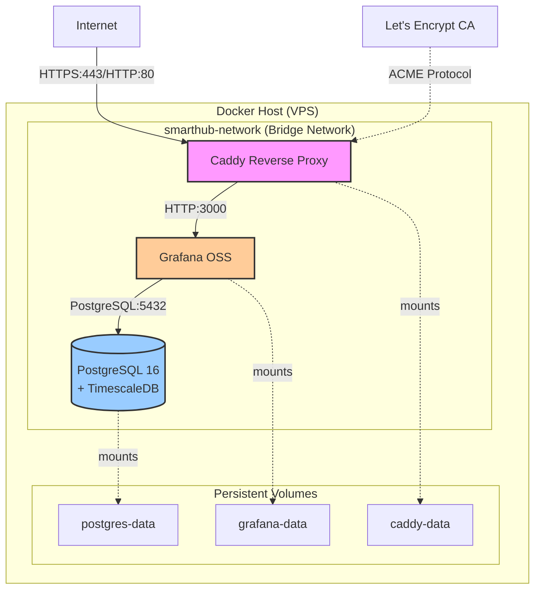

# Design Document: cloud-infra

## Overview

The cloud-infra feature provides the foundational infrastructure for the SmartHub IoT platform, deployed on a VPS environment. The design centers around a Docker Compose orchestrated stack that manages three core services: PostgreSQL 16 with TimescaleDB for data storage, Grafana OSS for monitoring and visualization, and Caddy for reverse proxy with automatic TLS certificate management.

The architecture prioritizes operational simplicity, security through network isolation, and reliability through health monitoring and automatic restarts. All services communicate over a private Docker network, with only the Caddy reverse proxy exposed to external networks. Data persistence is achieved through named Docker volumes, ensuring no data loss during container restarts or updates.

Key design decisions:
- **Docker Compose over Kubernetes**: For a single-VPS deployment, Docker Compose provides sufficient orchestration with significantly lower operational complexity
- **Caddy over Nginx**: Automatic TLS certificate management eliminates manual certificate renewal workflows
- **TimescaleDB extension**: Native PostgreSQL extension approach avoids the complexity of a separate time-series database
- **Environment-based secrets**: Simple .env file approach suitable for single-server deployment without requiring external secret management systems

## Architecture

### System Components



### Service Interaction Flow

1. **Startup Sequence**:
   - Docker Compose creates the `smarthub-network` bridge network
   - PostgreSQL container starts and initializes TimescaleDB extension
   - PostgreSQL health check validates database readiness
   - Grafana container starts after PostgreSQL health check passes
   - Grafana connects to PostgreSQL as a data source
   - Caddy container starts and begins ACME challenge for TLS certificates
   - Caddy routes external HTTPS traffic to Grafana

2. **Request Flow**:
   - Client initiates HTTP/HTTPS request to configured domain
   - Caddy receives request on port 80 or 443
   - If HTTP (port 80), Caddy redirects to HTTPS (port 443)
   - Caddy terminates TLS and forwards request to Grafana on port 3000
   - Grafana processes request and queries PostgreSQL if needed
   - Response flows back through Caddy to client

3. **Certificate Management Flow**:
   - Caddy detects missing or expiring TLS certificate
   - Caddy initiates ACME HTTP-01 challenge with Let's Encrypt
   - Let's Encrypt validates domain ownership
   - Caddy receives and stores certificate in persistent volume
   - Caddy automatically renews certificates 30 days before expiration

### Network Topology

- **External Network**: Only Caddy exposes ports 80 and 443 to the host network
- **Internal Network**: All services communicate over `smarthub-network` bridge network
- **Network Isolation**: PostgreSQL and Grafana are not accessible from external networks
- **DNS Resolution**: Docker's embedded DNS resolves service names (e.g., `postgres`, `grafana`) to container IP addresses

## Components and Interfaces

### Docker Compose Orchestrator

**Responsibility**: Manages the lifecycle of all infrastructure services, including creation, startup, health monitoring, and shutdown.

**Configuration File**: `docker-compose.yml`

**Key Behaviors**:
- Reads environment variables from `.env` file
- Creates named volumes for data persistence
- Creates bridge network for service communication
- Enforces service startup dependencies using `depends_on` with health conditions
- Restarts failed services automatically with `restart: unless-stopped` policy
- Provides health check definitions for each service

**Service Definitions**:
```yaml
services:
  postgres:
    image: timescale/timescaledb:latest-pg16
    restart: unless-stopped
    environment:
      POSTGRES_DB: ${POSTGRES_DB}
      POSTGRES_USER: ${POSTGRES_USER}
      POSTGRES_PASSWORD: ${POSTGRES_PASSWORD}
    volumes:
      - postgres-data:/var/lib/postgresql/data
    networks:
      - smarthub-network
    healthcheck:
      test: ["CMD-SHELL", "pg_isready -U ${POSTGRES_USER}"]
      interval: 30s
      timeout: 5s
      retries: 3

  grafana:
    image: grafana/grafana-oss:latest
    restart: unless-stopped
    environment:
      GF_SECURITY_ADMIN_USER: ${GRAFANA_ADMIN_USER}
      GF_SECURITY_ADMIN_PASSWORD: ${GRAFANA_ADMIN_PASSWORD}
      GF_SERVER_ROOT_URL: https://${GRAFANA_DOMAIN}
    volumes:
      - grafana-data:/var/lib/grafana
    networks:
      - smarthub-network
    depends_on:
      postgres:
        condition: service_healthy
    healthcheck:
      test: ["CMD-SHELL", "wget --no-verbose --tries=1 --spider http://localhost:3000/api/health || exit 1"]
      interval: 30s
      timeout: 5s
      retries: 3

  caddy:
    image: caddy:latest
    restart: unless-stopped
    ports:
      - "80:80"
      - "443:443"
    volumes:
      - ./Caddyfile:/etc/caddy/Caddyfile
      - caddy-data:/data
      - caddy-config:/config
    networks:
      - smarthub-network
    depends_on:
      grafana:
        condition: service_healthy
    healthcheck:
      test: ["CMD-SHELL", "wget --no-verbose --tries=1 --spider http://localhost:2019/metrics || exit 1"]
      interval: 30s
      timeout: 5s
      retries: 3

networks:
  smarthub-network:
    driver: bridge

volumes:
  postgres-data:
  grafana-data:
  caddy-data:
  caddy-config:
```

### PostgreSQL Service

**Image**: `timescale/timescaledb:latest-pg16`

**Responsibility**: Provides relational database storage with time-series optimization through TimescaleDB extension.

**Exposed Ports**: 
- 5432 (PostgreSQL) - accessible only on `smarthub-network`

**Environment Variables**:
- `POSTGRES_DB`: Database name
- `POSTGRES_USER`: Database superuser username
- `POSTGRES_PASSWORD`: Database superuser password

**Persistent Storage**:
- Volume: `postgres-data`
- Mount Point: `/var/lib/postgresql/data`
- Contains: Database files, WAL logs, configuration

**Health Check**:
- Command: `pg_isready -U ${POSTGRES_USER}`
- Interval: 30 seconds
- Timeout: 5 seconds
- Retries: 3

**Initialization**:
The TimescaleDB image automatically enables the TimescaleDB extension on first startup. No additional initialization scripts are required.

### Grafana Service

**Image**: `grafana/grafana-oss:latest`

**Responsibility**: Provides web-based monitoring, visualization, and dashboarding capabilities.

**Exposed Ports**:
- 3000 (HTTP) - accessible only on `smarthub-network`

**Environment Variables**:
- `GF_SECURITY_ADMIN_USER`: Admin username
- `GF_SECURITY_ADMIN_PASSWORD`: Admin password
- `GF_SERVER_ROOT_URL`: Public URL for Grafana (used for redirects and links)

**Persistent Storage**:
- Volume: `grafana-data`
- Mount Point: `/var/lib/grafana`
- Contains: Dashboards, data sources, user preferences, plugins

**Health Check**:
- Command: `wget --no-verbose --tries=1 --spider http://localhost:3000/api/health`
- Interval: 30 seconds
- Timeout: 5 seconds
- Retries: 3

**Data Source Configuration**:
PostgreSQL data source must be configured manually through Grafana UI or provisioning files after initial deployment:
- Host: `postgres:5432`
- Database: Value of `POSTGRES_DB`
- User: Value of `POSTGRES_USER`
- Password: Value of `POSTGRES_PASSWORD`
- SSL Mode: Disable (internal network communication)
- TimescaleDB: Enable

### Caddy Service

**Image**: `caddy:latest`

**Responsibility**: Reverse proxy with automatic HTTPS certificate management via Let's Encrypt ACME protocol.

**Exposed Ports**:
- 80 (HTTP) - exposed to host network for ACME HTTP-01 challenge and HTTP to HTTPS redirect
- 443 (HTTPS) - exposed to host network for secure traffic
- 2019 (Admin API) - accessible only within container for health checks

**Configuration File**: `Caddyfile`

**Persistent Storage**:
- Volume: `caddy-data` → `/data` (TLS certificates and keys)
- Volume: `caddy-config` → `/config` (Caddy configuration cache)

**Health Check**:
- Command: `wget --no-verbose --tries=1 --spider http://localhost:2019/metrics`
- Interval: 30 seconds
- Timeout: 5 seconds
- Retries: 3

**Caddyfile Configuration**:
```caddyfile
{
    email {$ACME_EMAIL}
}

{$GRAFANA_DOMAIN} {
    reverse_proxy grafana:3000
}
```

**TLS Certificate Management**:
- Automatic certificate acquisition on first request to configured domain
- Automatic renewal 30 days before expiration
- ACME HTTP-01 challenge (requires port 80 accessible from internet)
- Certificates stored in `/data/caddy/certificates`
- Fallback to self-signed certificate if ACME fails (logs error)

### Environment Configuration

**File**: `.env`

**Purpose**: Stores all secrets and configuration parameters outside of version control.

**Required Variables**:
```bash
# PostgreSQL Configuration
POSTGRES_DB=smarthub
POSTGRES_USER=smarthub_admin
POSTGRES_PASSWORD=<secure-random-password>

# Grafana Configuration
GRAFANA_ADMIN_USER=admin
GRAFANA_ADMIN_PASSWORD=<secure-random-password>
GRAFANA_DOMAIN=grafana.example.com

# Caddy Configuration
ACME_EMAIL=admin@example.com
```

**Security Considerations**:
- `.env` file must be excluded from version control via `.gitignore`
- Passwords should be generated using cryptographically secure random generators
- Minimum password length: 16 characters
- File permissions should be restricted to owner read/write only (chmod 600)

**Template File**: `.env.example`

Provides a template with placeholder values and documentation for each variable.

## Data Models

### Docker Compose Schema

The infrastructure is defined declaratively in `docker-compose.yml` following Docker Compose file format version 3.8+.

**Top-Level Keys**:
- `services`: Map of service definitions
- `networks`: Map of network definitions
- `volumes`: Map of volume definitions

**Service Schema**:
```yaml
<service-name>:
  image: <docker-image>:<tag>
  restart: <restart-policy>
  ports: [<host-port>:<container-port>]  # Optional, only for externally accessible services
  environment:
    <ENV_VAR>: <value-or-reference>
  volumes:
    - <volume-name>:<container-path>
    - <host-path>:<container-path>  # For configuration files
  networks:
    - <network-name>
  depends_on:
    <dependency-service>:
      condition: <service_healthy|service_started>
  healthcheck:
    test: [<command>]
    interval: <duration>
    timeout: <duration>
    retries: <count>
```

**Network Schema**:
```yaml
<network-name>:
  driver: bridge
```

**Volume Schema**:
```yaml
<volume-name>: {}  # Empty object for default driver
```

### Environment Variable Schema

The `.env` file follows standard shell environment variable syntax:

```
KEY=value
```

**Constraints**:
- No spaces around `=` sign
- Values with spaces must be quoted
- Comments start with `#`
- Variable references use `${VAR_NAME}` syntax in docker-compose.yml

### Persistent Volume Data

**postgres-data Volume**:
- **Location**: Docker managed volume (typically `/var/lib/docker/volumes/postgres-data/_data`)
- **Contents**: PostgreSQL data directory including:
  - Database files (base/)
  - Write-Ahead Log files (pg_wal/)
  - Configuration files (postgresql.conf, pg_hba.conf)
  - TimescaleDB extension files

**grafana-data Volume**:
- **Location**: Docker managed volume
- **Contents**: Grafana data directory including:
  - SQLite database (grafana.db) - stores dashboards, users, data sources
  - Plugins directory
  - Session data
  - Provisioning state

**caddy-data Volume**:
- **Location**: Docker managed volume
- **Contents**:
  - TLS certificates (certificates/)
  - Private keys
  - ACME account information
  - Certificate metadata

**caddy-config Volume**:
- **Location**: Docker managed volume
- **Contents**:
  - Caddy configuration cache
  - Compiled Caddyfile representation

### Health Check Response Models

**PostgreSQL Health Check**:
- **Command**: `pg_isready -U ${POSTGRES_USER}`
- **Success Output**: `<host>:<port> - accepting connections`
- **Exit Code**: 0 (healthy), non-zero (unhealthy)

**Grafana Health Check**:
- **Endpoint**: `GET http://localhost:3000/api/health`
- **Success Response**: HTTP 200 with JSON body:
  ```json
  {
    "database": "ok",
    "version": "<version-string>"
  }
  ```
- **Exit Code**: 0 (healthy), non-zero (unhealthy)

**Caddy Health Check**:
- **Endpoint**: `GET http://localhost:2019/metrics`
- **Success Response**: HTTP 200 with Prometheus-format metrics
- **Exit Code**: 0 (healthy), non-zero (unhealthy)


## Correctness Properties

*A property is a characteristic or behavior that should hold true across all valid executions of a system—essentially, a formal statement about what the system should do. Properties serve as the bridge between human-readable specifications and machine-verifiable correctness guarantees.*

### Property Reflection

After analyzing all acceptance criteria, I identified the following patterns:

**Redundancies Eliminated**:
- Multiple criteria about volume persistence (2.3, 3.2, 4.7, 6.1, 6.2, 6.3) → Combined into Property 1
- Multiple criteria about network isolation (2.5, 3.4, 8.2, 8.3) → Combined into Property 2
- Multiple criteria about health check intervals (7.5 for all services) → Combined into Property 4
- Multiple criteria about health check retries (7.4 for all services) → Combined into Property 5
- Duplicate criteria about network creation (1.2, 8.1) → Single property
- Duplicate criteria about .env.example existence (5.6, 10.2) → Single property

**Properties vs Examples**:
Most acceptance criteria test specific configuration file content (e.g., "postgres service uses pg16 image"), which are examples rather than universal properties. However, some criteria express rules that should hold across all services or all configuration elements, making them suitable for property-based testing.

**Non-Testable Criteria**:
Runtime behaviors that require actual container execution (certificate acquisition, database connections, graceful shutdown) cannot be tested through static configuration analysis and are excluded from properties.

### Property 1: Volume Persistence Completeness

*For any* service in the docker-compose.yml that manages persistent data (postgres, grafana, caddy), that service must have at least one named volume mounted to its data directory.

**Validates: Requirements 2.3, 3.2, 4.7, 6.1, 6.2, 6.3**

### Property 2: Network Isolation for Internal Services

*For any* service in the docker-compose.yml that is not a reverse proxy (postgres, grafana), that service must not have any port mappings to the host network.

**Validates: Requirements 2.5, 3.4, 8.2, 8.3**

### Property 3: Volume Naming Convention

*For any* named volume in the docker-compose.yml, the volume name must contain a service identifier that indicates which service uses it.

**Validates: Requirements 6.5**

### Property 4: Health Check Interval Consistency

*For any* service in the docker-compose.yml that has a health check defined, the health check interval must be 30 seconds.

**Validates: Requirements 7.5**

### Property 5: Health Check Retry Consistency

*For any* service in the docker-compose.yml that has a health check defined, the health check must be configured with exactly 3 retries.

**Validates: Requirements 7.4**

### Property 6: No Hardcoded Secrets

*For any* environment variable value in the docker-compose.yml that contains credential-related keywords (password, secret, key, token), the value must be a variable reference (${VAR_NAME}) and not a hardcoded string.

**Validates: Requirements 5.1**

### Property 7: Required Environment Variables Documented

*For any* environment variable referenced in docker-compose.yml with ${VAR_NAME} syntax, that variable name must appear in the .env.example file.

**Validates: Requirements 10.3**

### Property 8: Service Dependency Chain Validity

*For any* service in the docker-compose.yml that has a depends_on configuration, all referenced dependency services must exist as defined services in the same file.

**Validates: Requirements 9.1, 9.2, 9.3, 9.4**

## Error Handling

### Configuration Errors

**Missing Environment Variables**:
- **Detection**: Docker Compose validates environment variable references at startup
- **Behavior**: Compose exits with error message indicating which variables are undefined
- **Recovery**: User must define missing variables in .env file and restart
- **Prevention**: Provide comprehensive .env.example with all required variables

**Invalid Docker Compose Syntax**:
- **Detection**: Docker Compose validates YAML syntax and schema at startup
- **Behavior**: Compose exits with error message indicating syntax error location
- **Recovery**: User must fix YAML syntax errors in docker-compose.yml
- **Prevention**: Use YAML linting tools and Docker Compose validation during development

**Port Conflicts**:
- **Detection**: Docker daemon detects port binding conflicts when starting containers
- **Behavior**: Container fails to start with "port already allocated" error
- **Recovery**: User must stop conflicting service or change port mapping
- **Prevention**: Document required ports in README and check for conflicts before deployment

### Runtime Errors

**Health Check Failures**:
- **Detection**: Docker monitors health check command exit codes
- **Behavior**: After 3 consecutive failures, Docker marks container as unhealthy and restarts it (due to restart policy)
- **Recovery**: Automatic restart attempts to recover service
- **Logging**: Health check failures logged to container logs (viewable via `docker compose logs`)
- **Escalation**: If restarts continue failing, manual intervention required to diagnose root cause

**TLS Certificate Acquisition Failure**:
- **Detection**: Caddy logs ACME challenge failures
- **Behavior**: Caddy falls back to self-signed certificate and continues serving traffic
- **Recovery**: Caddy automatically retries certificate acquisition on next request
- **Common Causes**:
  - Domain DNS not pointing to server IP
  - Firewall blocking port 80 (required for HTTP-01 challenge)
  - Rate limiting from Let's Encrypt (5 failures per hour per domain)
- **Logging**: ACME errors logged to Caddy container logs
- **Manual Recovery**: Fix DNS/firewall issues, wait for rate limit reset, restart Caddy

**Database Connection Failures**:
- **Detection**: Grafana logs connection errors when attempting to query PostgreSQL
- **Behavior**: Grafana continues running but data source queries fail
- **Recovery**: Automatic reconnection on next query attempt
- **Common Causes**:
  - PostgreSQL container not healthy
  - Network connectivity issues
  - Invalid credentials
- **Logging**: Connection errors logged to Grafana container logs
- **Manual Recovery**: Verify PostgreSQL health, check credentials, restart Grafana if needed

**Volume Mount Failures**:
- **Detection**: Docker daemon detects volume mount errors at container startup
- **Behavior**: Container fails to start with volume mount error
- **Recovery**: Manual intervention required
- **Common Causes**:
  - Insufficient disk space
  - Permission issues on host filesystem
  - Corrupted volume data
- **Logging**: Mount errors logged to Docker daemon logs
- **Manual Recovery**: Free disk space, fix permissions, or remove/recreate volume

### Operational Errors

**Insufficient Disk Space**:
- **Detection**: Docker daemon or container processes encounter disk full errors
- **Behavior**: Write operations fail, containers may crash
- **Recovery**: Free disk space and restart affected containers
- **Prevention**: Monitor disk usage, implement log rotation, prune unused Docker resources
- **Monitoring**: Set up disk space alerts in Grafana

**Memory Exhaustion**:
- **Detection**: OOM killer terminates container processes
- **Behavior**: Container exits with exit code 137
- **Recovery**: Docker restart policy automatically restarts container
- **Prevention**: Set memory limits in docker-compose.yml if needed
- **Monitoring**: Set up memory usage alerts in Grafana

**Network Connectivity Loss**:
- **Detection**: Services unable to resolve DNS or connect to each other
- **Behavior**: Health checks fail, services restart
- **Recovery**: Automatic recovery when network connectivity restored
- **Common Causes**:
  - Docker network driver issues
  - Host network configuration changes
  - DNS resolution failures
- **Manual Recovery**: Restart Docker daemon or recreate Docker network

## Testing Strategy

### Dual Testing Approach

The cloud-infra feature requires both unit testing and property-based testing to ensure comprehensive coverage:

**Unit Tests**: Verify specific configuration examples, edge cases, and error conditions
- Specific service configurations (e.g., PostgreSQL uses correct image tag)
- Presence of required files (docker-compose.yml, .env.example, README.md)
- Specific dependency relationships (e.g., Grafana depends on PostgreSQL)
- Specific health check commands for each service
- Specific port mappings for Caddy service
- README content includes required sections

**Property Tests**: Verify universal properties across all configuration elements
- All data-managing services have volume persistence
- All internal services lack external port mappings
- All volume names follow naming conventions
- All health checks have consistent intervals and retries
- No secrets are hardcoded in configuration
- All referenced environment variables are documented
- All service dependencies reference valid services

Together, unit tests catch concrete configuration bugs while property tests verify general correctness across the entire configuration structure.

### Property-Based Testing Configuration

**Testing Library**: For this infrastructure-as-code project, property-based testing will be implemented using Python with the `hypothesis` library, as the tests will parse and validate YAML configuration files.

**Test Configuration**:
- Minimum 100 iterations per property test (due to randomization in test data generation)
- Each property test must reference its design document property using a comment tag
- Tag format: `# Feature: cloud-infra, Property {number}: {property_text}`

**Example Property Test Structure**:

```python
from hypothesis import given, strategies as st
import yaml

# Feature: cloud-infra, Property 1: Volume Persistence Completeness
@given(st.data())
def test_volume_persistence_completeness(data):
    """For any service that manages persistent data, verify it has volume mounts."""
    compose = load_docker_compose()
    data_services = ['postgres', 'grafana', 'caddy']
    
    for service_name in data_services:
        service = compose['services'][service_name]
        assert 'volumes' in service, f"{service_name} missing volumes"
        assert len(service['volumes']) > 0, f"{service_name} has no volume mounts"
```

### Unit Testing Strategy

**Configuration Validation Tests**:
- Parse docker-compose.yml and validate structure
- Verify each service uses correct Docker image
- Verify environment variable references are present
- Verify health check commands are correct
- Verify network configuration is present
- Verify volume definitions exist

**File Existence Tests**:
- Verify docker-compose.yml exists
- Verify .env.example exists
- Verify Caddyfile exists
- Verify README.md exists
- Verify .gitignore exists and excludes .env

**Documentation Tests**:
- Verify README contains deployment instructions
- Verify README contains environment variable documentation
- Verify README contains verification steps
- Verify README contains backup/restore procedures
- Verify .env.example contains all required variables with descriptions

**Dependency Tests**:
- Verify Grafana depends on PostgreSQL with service_healthy condition
- Verify Caddy depends on Grafana with health condition
- Verify dependency chain forms valid directed acyclic graph (no cycles)

### Integration Testing Strategy

While unit and property tests validate configuration correctness, integration tests verify runtime behavior:

**Deployment Tests**:
- Deploy stack using `docker compose up -d`
- Verify all containers start successfully
- Verify all containers reach healthy state within timeout
- Verify no containers restart unexpectedly

**Connectivity Tests**:
- Verify Grafana can connect to PostgreSQL
- Verify Caddy can proxy requests to Grafana
- Verify external HTTPS access to Grafana through Caddy
- Verify HTTP to HTTPS redirect works

**Persistence Tests**:
- Create data in PostgreSQL and Grafana
- Restart containers
- Verify data persists after restart

**Health Check Tests**:
- Verify health checks report healthy status
- Simulate health check failure
- Verify container restarts automatically

**TLS Certificate Tests** (requires valid domain):
- Verify Caddy obtains certificate from Let's Encrypt
- Verify certificate is valid and trusted
- Verify certificate auto-renewal works

### Test Execution

**Unit and Property Tests**:
```bash
pytest tests/unit/ -v
pytest tests/properties/ -v --hypothesis-show-statistics
```

**Integration Tests**:
```bash
pytest tests/integration/ -v --docker-compose-file=docker-compose.yml
```

**Continuous Integration**:
- Run unit and property tests on every commit
- Run integration tests on pull requests
- Run full integration tests including TLS on staging environment

### Test Coverage Goals

- **Configuration Coverage**: 100% of docker-compose.yml services and settings validated
- **Property Coverage**: All 8 correctness properties implemented as property tests
- **Documentation Coverage**: All required documentation sections verified
- **Integration Coverage**: All critical runtime behaviors verified

